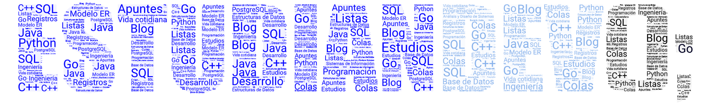

+++
date = "2022-10-21T16:58:42-04:00"
keywords = ["universidad", "programacion", "base de datos", "sql", "estudiandev", "estudiante", "desarrollador"]
description = "Bienvenido al blog de un estudiante developer, donde iré publicando apuntes y cosas de interés sobre lo que aprenda tanto en la universidad como en el mundo de la industria IT."
color = "blue" #color from the theme settings
cover = "cover.png"
framed = true
+++

# _Un blog de un_ Estudian*te* Dev*eloper*

Hola, soy Henrry, bienvenido al blog de un **estudian**te que es Back-End **dev**eloper donde iré anotando todos los apuntes que vaya anotando en las clases de la universidad, y de los cursos que vea.

## ¿Qué encontrarás aquí?

Pues, muchos apuntes que anoto en las clases de las materias/asignaturas que veo en la carrera de Ingeniería de Sistemas, aunque también encontrarás varios apuntes provenientes de cursos que realice.

Además, encontrarás varios tags con los que se te hará más fácil conseguir los apuntes que necesites.

### Sobre mí

Tengo 19 años, estoy en el 5to semestre de Ingeniería de Sistemas. Subo contenido a redes sociales como Twitter, TikTok e Instagram, tal vez vuelva a subir contenido pronto...

Puedes encontrar más sobre mi en mi [portafolio](https://www.henrry.online) por si quieres contratarme ;)
